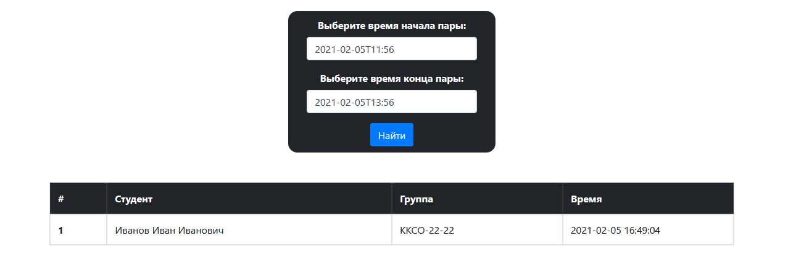

# Отмечалка на паре

Бот для телеграмма, который поможет удобно отмечать людей на паре во время дистанционного обучения с помощью OTP-QR кодов.

Такой подход может применяться и во время очного обучения, т.к. не дает возможности студентам не на паре отметиться, поскольку время генерации кодов очень короткое, следовательно исключается возможность сфотографировать код и отправить другому студенту.

------
#### Установка

Необходимо установить зависимости, которые требуются для работы. Просто выполняем эту команду в терминале.

```bash
pip3 install -r requirements.txt
```

------
#### Запуск бота

Бот имеет серверную часть, которая лежит в папке `bot`, и веб-сервер, который лежит в папке `www`.

Чтобы запустить бота нужно сделать такую последовательность действий:

```bash
cd bot/
export TOKEN_CHECKER_OS="<YOUR:TELEGRAM_TOKEN>"
python3 bot.py
```

При запуске вываливается `Warning`. На него можно не обращать внимание. Поскольку это не чат бот, то нам не нужно отлавливать все сообщения. Собственно, об этом нас и предупреждает этот `Warning`.

Бот также автоматически стартует `web-server` по адресу `http://127.0.0.1:8080/`, который поднимается локально и не доступен из вне.

------
#### Настройка бота 

Для настройки бота достаточно добавить в переменную окружения `TOKEN_CHECKER_OS` токен телеграмм бота, который можно получить в телеграмме.

------
#### Хранение данных

Данные о пользователях хранятся в базе данных `bot/db/students.sqlite`. С помощью временных меток в базе данных можно получать пользователей в определённый промежуток времени, например соотнося со временем пары.

------
#### Примеры

Как выглядит фронт часть, которую видят студенты. Чтобы избежать статики, для привлечения внимания студентов были сделаны анимация эффекта матрицы и гиф анимация с ожидающим котом.


Так выглядит часть, которая видна преподавателю. На картинке ниже можно наблюдать функциональность бота, ведется полное логирование действий пользователя.


Полезная функция, это выявление студентов, которые попытались зайти либо по некорректному qr, либо попытались сделать это 3 и более раз. Увидеть это можно с помощью цветовых индикаторов, жёлтым цветом помечается некорректный вход, красным цветом - подозрительный студент.

------
#### Админка
Также для преподавателя существует панель администратора, где можно просто указав время начала и конца занятия выбрать всех студентов, которые отметились в этот период времени.

Попасть на эту страницу можно по адресу `http://127.0.0.1:8080/admin`. Поскольку данная страница запущена локально, то нет нужны проводить этапы авторизации и аутентификации.

