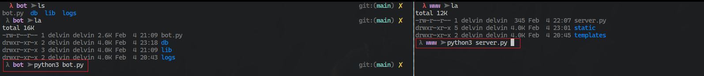
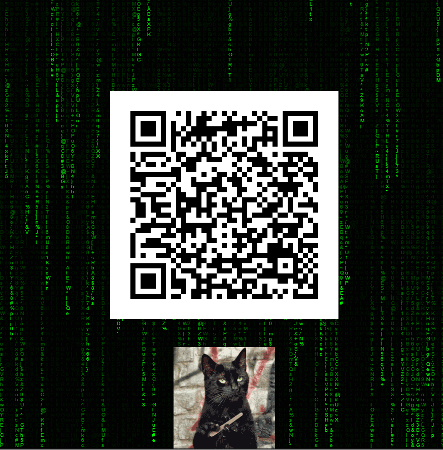
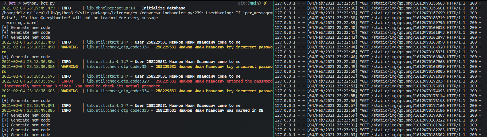

# Отмечалка на паре

Бот для телеграмма, который поможет удобно отмечать людей на паре во время дистанционного обучения с помощью OTP-QR кодов.

Такой подход может применяться и во время очного обучения, т.к. не дает возможности студентам не на паре отметиться, поскольку время генерации кодов очень короткое, следовательно исключается возможность сфотографировать код и отправить другому студенту.

------

#### Установка
При запуске вываливается `Warning`. На него можно не обращать внимание. Поскольку это не чат бот, то нам не нужно отлавливать все сообщения. Собственно, об этом нас и предупреждает этот `Warning`.

```bash
pip3 install -r requirements.txt
```

------

#### Запуск бота

Бот имеет серверную часть, которая лежит в папке `bot`, и веб-сервер, который лежит в папке `www`. Для удобства рекомендуется использовать `tmux`.

В первой панели заходим в папку `bot`, экспортируем токен бота и запускаем: `python3 bot.py`.

Во второй панели переходим в папку `www` и запускаем: `python3 server.py`

Теперь бот запущен, в левом окне поднимается телеграмм бот, в правом окне веб-сервер, на котором можно демонстрировать QR-код.

Ниже представлен пример запуска. В левой панели открыта папка с ботом, в правой с веб сервером.



------

#### Настройка бота 

Для настройки бота достаточно добавить в переменную окружения `TOKEN_CHECKER_OS` токен телеграмм бота, который можно получить в телеграмме.

------

#### Хранение данных

Данные о пользователях хранятся в базе данных `db/students.sqlite`. С помощью временных меток в базе данных можно получать пользователей в определённый промежуток времени, например соотнося со временем пары.

------

#### Примеры

Как выглядит фронт часть, которую видят студенты. Чтобы избежать статики, для привлечения внимания студентов были сделаны анимация эффекта матрицы и гиф анимация с ожидающим котом.



Так выглядит часть, которая видна преподавателю. Слева можно наблюдать функциональность бота, ведется полное логирование действий пользователя. На правой панеле запущен веб-сервер, к которому фронт обращается каждую секунду для получения нового изображения. Такой подход позволяет избежать рассинхронизации между запуском бота и веб-сервера.



Полезная функция, это выявление студентов, которые попытались зайти либо по некорректному qr, либо попытались сделать это 3 и более раз. Увидеть это можно с помощью цветовых индикаторов, жёлтым цветом помечается некорректный вход, красным цветом - подозрительный студент.